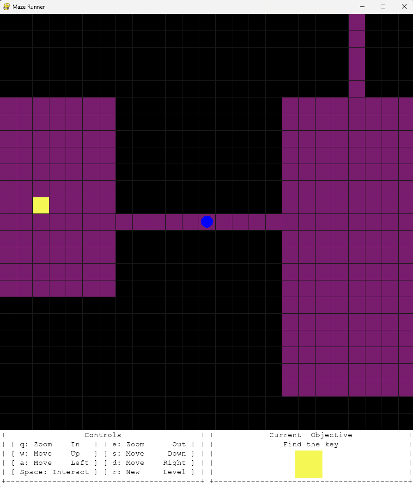
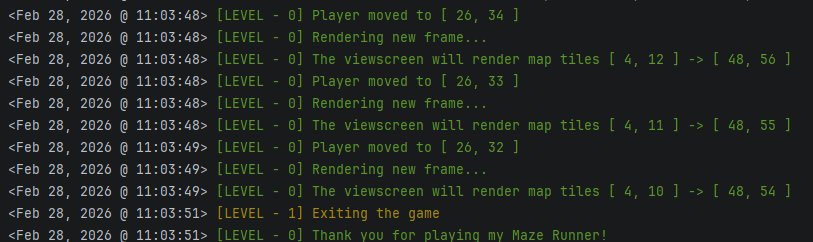

# Maze-Runner
A Python based maze running video game. This was my class project for UofL's CSE 120 course

This is a video game that I made for my final project in UofL's introduction to programming course. 
It is a simple maze running game, inspired by the old ascii-art games such as Rogue or NetHack.
It features a simple game-loop: you as the player must scour the maze for the key to the exit.

Thats... it.

Once you find the exit, a new level is generated, and the cycle is repeated. I guess the only real way to win IS to not play.

---

## How it works

I used the PyGame library ( Version 2.6.1 ) to manage the visuals, and the user input. Everything else in the game uses classes to encapsulate related data.

Before I dive in to how each class works and relates to the others, I will give a basic overview of how the game works.
Each level is randomly generated. The board class manages the game objects and a list of all the current rooms. 
Each time a level is generated the board is cleared and a new set of nine rooms with random widths, heights, and locations is generated.
Then, each room is connected using a simple tunneling algorithm. Then, the game objects are randomly scattered around the map
before control of the program is handed back to the engine class and the game begins.

---

## Class Overview

---

### Logger

---

To start things off, I designed a simple terminal logging system that I used to track the game's internal state to make 
debugging easier. Each log gets a time-stamp, and can be one of three severity levels ( 0 -> 2 ). Each level has a 
unique color when to make identification quicker. I also included a textual indication for users who do not have a 
terminal that support colored text. The entire logging system can be enabled / disabled by use of a boolean flag.

 

 

 

### Game Object

---

### Player

---

### Key

---

### Door

---

### Room

---

### Board

---

### Engine

---